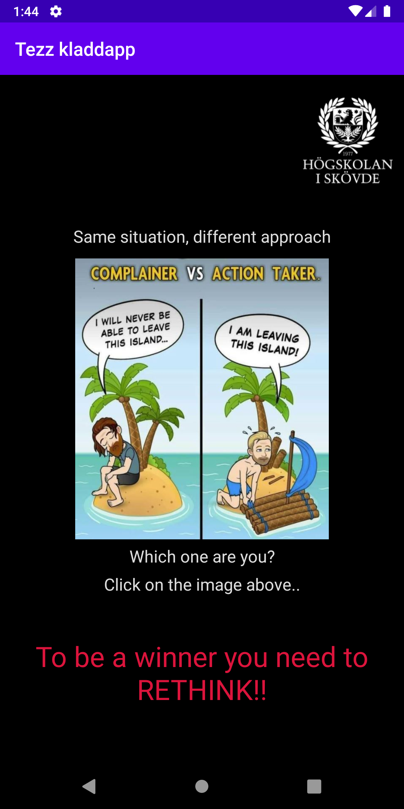
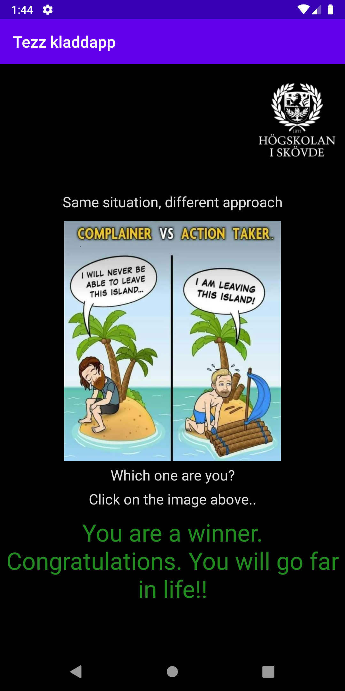

RAPPORT ASSIGNMENT 3

Beskrivning uppgift.
I denna uppgiften har jag lärt mig att arbeta mera med layout och olika element. Jag valde att använda
mig av en constranitlayout och positionerade ut mina element genom att använda constraintTop_toTopOf
och gjorde samma för right/left/bottom. Ville jag att elementet skulle hoppa längst ner på skärmen
tog jag bort constraintTop osv. Jag kompleterade dessa attribut med margins för att flytta innehåll
exakt dit jag ville ha det. Målet med uppgiften var att använda sig av en layouttyp och sedan
positionera 3 olika element men efter lite arbetande så kom jag in i det och resultatet blev mera.

Tillvägagångssätt.
Jag valde constraintlayout då jag tyckte det såg roligast ut. För denna uppgift har jag egentligen
skapat två appar men skrotade första idén då den var tråkig. Andra idén blev min slutgiltiga och den
var mer utmanade och lärde mig betydligt mycket mera av programmet och olika attribut.
Jag la till två bilder och tre texter och positionerade dom med hjälp av diverse attribut. När de
lätta element var utlagda klurade jag lite på hur jag skulle lösa klickandet för att få fram mina
budskap beroende på vilken personlighetstyp man är i bilden. Jag snappade under lektionen upp att
man kunde lägga en transparent knapp som man gav en action så jag lekte med detta och hittade en
alphainställning som gjorde den genomskinlig. Jag skapade två knappar och gav dom id left_button och
right_button sedan skapade jag mina två texter i varsin TextView och gav dom id left_text och
right_text. Sedan bytte jag till MainActivity och deklarerade privata variabler och gav dom namn
textViewLeft och textViewRight. Sedan i onCreate anropade jag först min vänstra TextView via id och
sedan min vänstra knapp som jag satte en OnClickListerner på och i knappen en onClick där jag angav
att textViewLeft skulle visas och textViewRight skulle vara osynligt. Sedan repeterade jag exakt
samma för min text och knapp för högra delen av bilden.

Resultatet.
När man klickar på vänstra delen av bilden så visas en text med ett budskap jag hade för dom som gör
det, när man klickar på högra sker samma för högre personlighetstypen. Budskapen skrivs inte över
varandra utan man kan klicka fram och tillbaka hur mycket man vill.

KODSNUTT FRÅN MIN APP.

Koden i Main Activity för de båda knapparna.
```
textViewLeft = findViewById(R.id.left_text);
Button button = findViewById(R.id.left_button);
    button.setOnClickListener(new View.OnClickListener() {
        @Override
        public void onClick(View v) {
            textViewLeft.setVisibility(View.VISIBLE);
            textViewRight.setVisibility(View.INVISIBLE);
        }
    });

textViewRight = findViewById(R.id.right_text);
Button button2 = findViewById(R.id.right_button);
    button2.setOnClickListener(new View.OnClickListener() {
        @Override
        public void onClick(View v) {
            textViewRight.setVisibility(View.VISIBLE);
            textViewLeft.setVisibility(View.INVISIBLE);
        }
    });
```

Kod från ativity_main.xml för de ena knappen och ena texten.
```
<Button
        android:id="@+id/left_button"
        android:layout_width="150dp"
        android:layout_height="320dp"
        android:layout_marginLeft="68dp"
        android:layout_marginBottom="224dp"
        android:alpha="0"
        app:layout_constraintBottom_toBottomOf="parent"
        app:layout_constraintLeft_toLeftOf="parent" />

<TextView
        android:id="@+id/left_text"
        android:layout_width="wrap_content"
        android:layout_height="wrap_content"
        android:text="To be a winner you need to RETHINK!!"
        android:gravity="center_horizontal"
        android:textColor="#DC143C"
        android:textSize="30dp"
        android:visibility="invisible"
        android:layout_marginBottom="60dp"
        app:layout_constraintRight_toRightOf="parent"
        app:layout_constraintLeft_toLeftOf="parent"
        app:layout_constraintBottom_toBottomOf="parent"/>
```

Här är screenshot tagna med Android virtual device.
Meddelande när man väljer vänstra bilden (klickar på vänstra knappen)


Meddelande när man väljer högra bilden (klickar på högre knappen)
